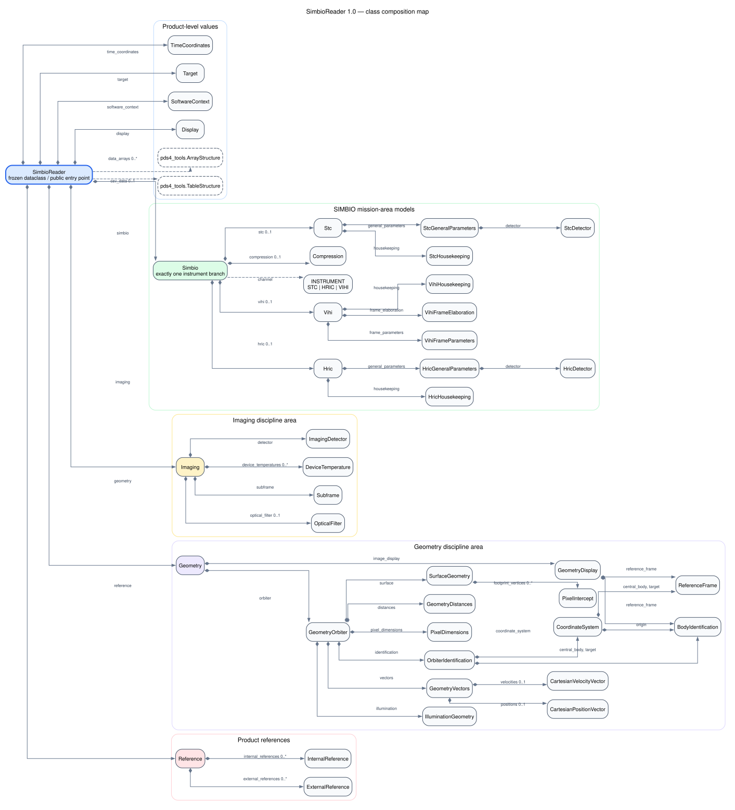

Class map
=========

The public :class:`SimbioReader.SimbioReader` object is a composition root:
it reads one PDS4 product and exposes its data structures and typed metadata
models.  The current model uses composition rather than application-level
class inheritance.  The map follows objects reachable from that public entry
point; CLI information helpers are outside its scope.

In the map, a diamond denotes ownership by composition, a dashed arrow denotes
an external type or enum dependency, ``0..1`` denotes an optional value, and
``0..*`` denotes a tuple that may be empty.

Instrument branch
-----------------

``Simbio.channel`` selects exactly one of ``Simbio.stc``, ``Simbio.hric``, or
``Simbio.vihi``.  Accessing a different instrument property raises
``AttributeError``.  STC and HRIC contain housekeeping and general-parameter
models; VIHI contains frame parameters, frame elaboration, and housekeeping.

Discipline and reference branches
---------------------------------

``display``, ``imaging``, and ``geometry`` model the corresponding PDS4
discipline-area blocks.  ``reference`` contains the product's internal and
external references.  Geometry is the deepest branch and groups display
orientation, orbiter identification, pixel and distance values, surface and
illumination values, and optional position and velocity vectors.

The editable Graphviz source for this diagram is available as
:download:`class-map.dot <_static/class-map.dot>`.
